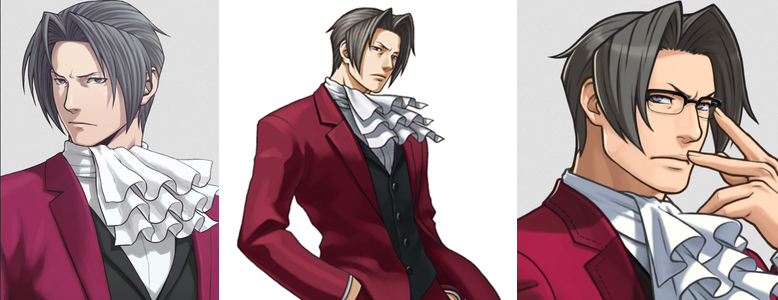

I've always wanted to be more like, and had a mild man-crush on, Miles Edgeworth.

What can I say, cravats are sexy. ❤️

You don't need to know who he is. Just that I've idealized Edgeworth, and others like him, for their eccentric level of intelligence. They effortlessly see the truth and stay two steps ahead of enemies. That's why people need them, and how they do so much good. He's like Dr. House, except working in law, is a more charming kind of jerk, and asexual.

I've always wanted to be dangerously brilliant like him. But as you may know, I'm just a young front-end coder. It's safe to say I'm not like smart and never will be. I doubt CSS will help solve murders, except for when it makes back-end coders kill someone.

Trying to be like him anyway has been like forcing a square peg in a round hole - pointless, frustrating, and breaks my fingernails. Much as I admire Edgeworth, and similar far-off personalities, trying to be him isn't what's best for me.

But there's lots of things I can be. I can be curious. I can explain tough info clearly. I can get engrossed in solving complex coding puzzles. I can isolate myself indoors with books and games amid mild social anxiety and loneliness.

The takeaway from _most_ of those strengths is **it's important to be who I am and do what I can.** Max is all I'll ever be, and no one else can be that. Might as well do some good that way instead of wasting weekends trying on cravats.
