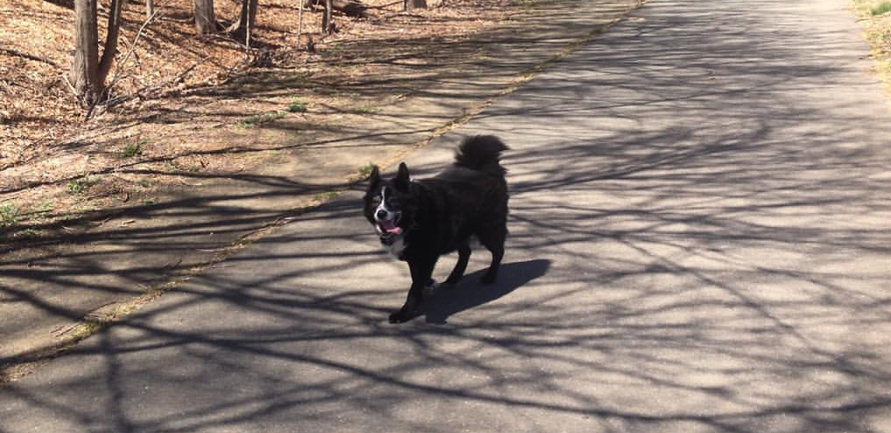
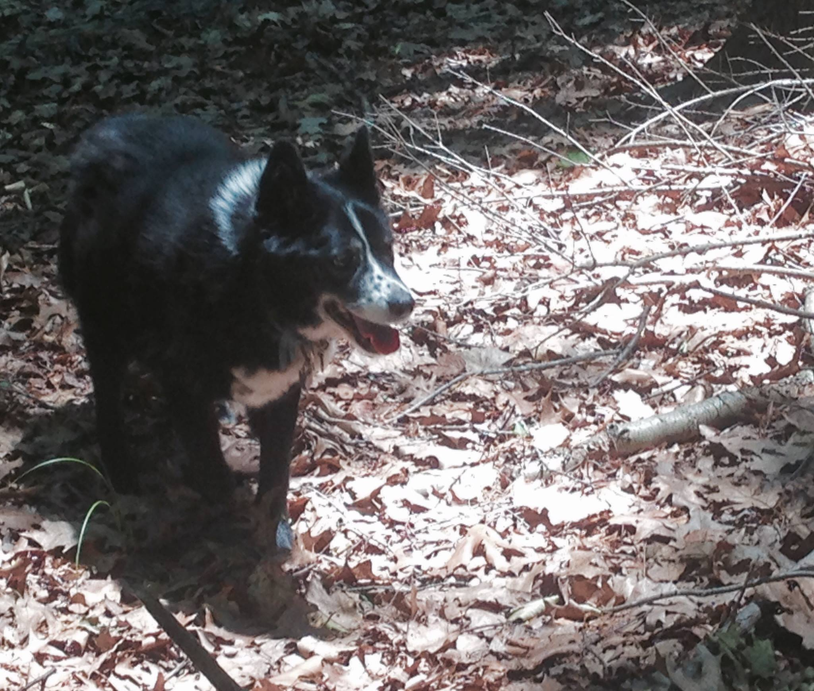
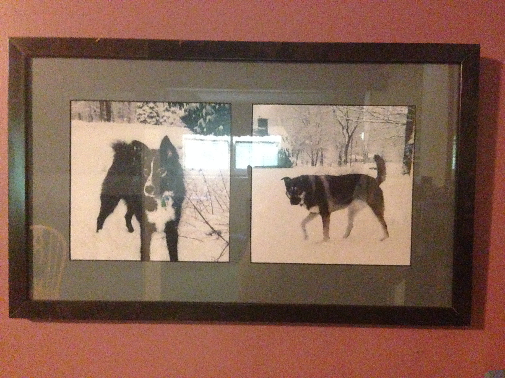
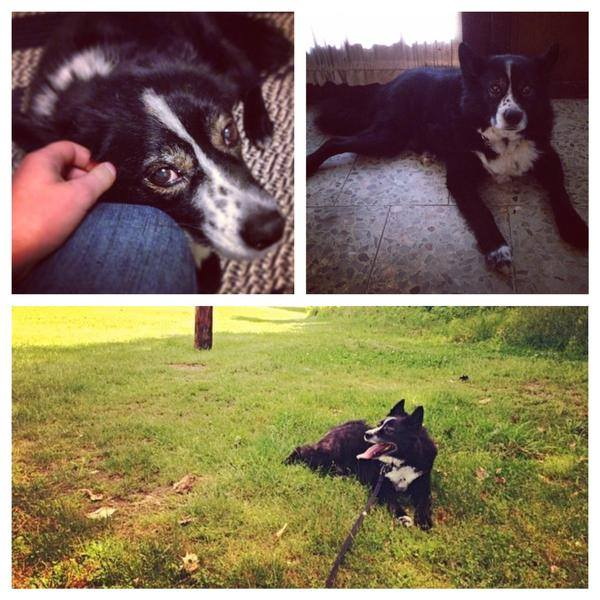

I've never been scared of death itself, only the times where it's on the horizon.

To me it never made sense to fear death. A book I read in middle school described death as "a wall on a road that goes up for eternity, left for eternity, right for eternity, down for eternity, and is as thick as eternity." No matter what we do, it will be there. That makes fear pretty pointless, since it's meant to help people avoid danger. With a danger that can't be avoided, fear won't change much.

Whether or not there's pain doesn't affect this. The amount of pain I'd feel during death is equal to the amount of relief I'd feel from it. Plus pain isn't exclusive to death - I imagine I've got as much pain in my future as I do pleasure. And that's fine. If we didn't have pain, pleasure wouldn't exist. Likewise if we didn't have death, life wouldn't exist. The worse I'd feel about one, the better I'd feel about their counterpoint. It all equals a calm acceptance of death when it arrives.

So I don't fear death. I fear when death is creeping into view but isn't quite there. When you can measure the final distance between you and death. A rush to do the things we now don't have time for. It throws questions of how we should act, how we should feel, if we did enough things right, if we did too many things wrong.

We have no time to answer any of those questions that need an answer when the distance is so short. The panic and realization of death without the peace of mind and acceptance. All the pointless fear before the acceptance. A clawing uncertainty.

All those feelings sum up my last week. The last week we had with Jasper.

He was getting slower and weaker. Eating less and always laying outside. Needed help just to walk across tiled floors. Every moment I was feeling that clawing uncertainty. Had I done something to cause this? What can I do now? What more could we have done to make him happy? What if this isn't the end? Even worse, what if it is?

Painful as it was to think about, I could see something just over the horizon. The remaining distance now visible and getting shorter.

It lasted all the way until this morning. The vet said it was internal bleeding caused by a large tumor. He only had a few months at most. The best decision would be to peacefully put him down. Like a candle the uncertainty was blown out and I was left full of shadows.

I could only ask myself: now what? There's no uncertainty or fear, so how do I feel?

All I knew was I didn't want to feel the same as last time.

This "last time" was when our other dog, Maya, passed away. It was several years ago. I was at school in Upstate New York, studying in the library. There was a phone call, the news, and an empty line. Then a stale feeling in my chest.

No collapse. No tearing up in public. No rush of good memories. Just a stale feeling as my mind unjammed itself and went back to studying. It nudged me for the attention it needed but I didn't give.

I hate the short distance between life and death in these times. But I hate something even more: the huge distance between my feelings and Maya's death. A distance I never managed to close.

I didn't want to feel that kind of distance again. So I held Jasper close, told him I loved him, kissed his forehead and let him lick my face one more time. The tears were coming but I couldn't break yet. We drove home, cleaned some things up, and I called some family with the news. Then I went into my room and broke. The collapse. The tears. The rush of memories. A lot more.

There was no longer any fear, uncertainty, or distance. There were lots of feelings now. They were all bittersweet. I knew I was only so sad because I'd been so happy before, for so long. It took a while to balance out, but I eventually got to that calm acceptance. It slips in and out, but it will stay with time. Then I'll be able to think about Jasper with a smile instead of more tears.

***

Being a short distance from death is terrible, but a huge distance is worse. There's no terrible feelings, but no good ones either. When it comes to death, we shouldn't regret having to close that distance with others or with ourselves.

Because avoiding death forever means avoiding life forever. Like a life with a loyal, quirky, and lovable dog that you will miss immensely but will have no regrets about.
